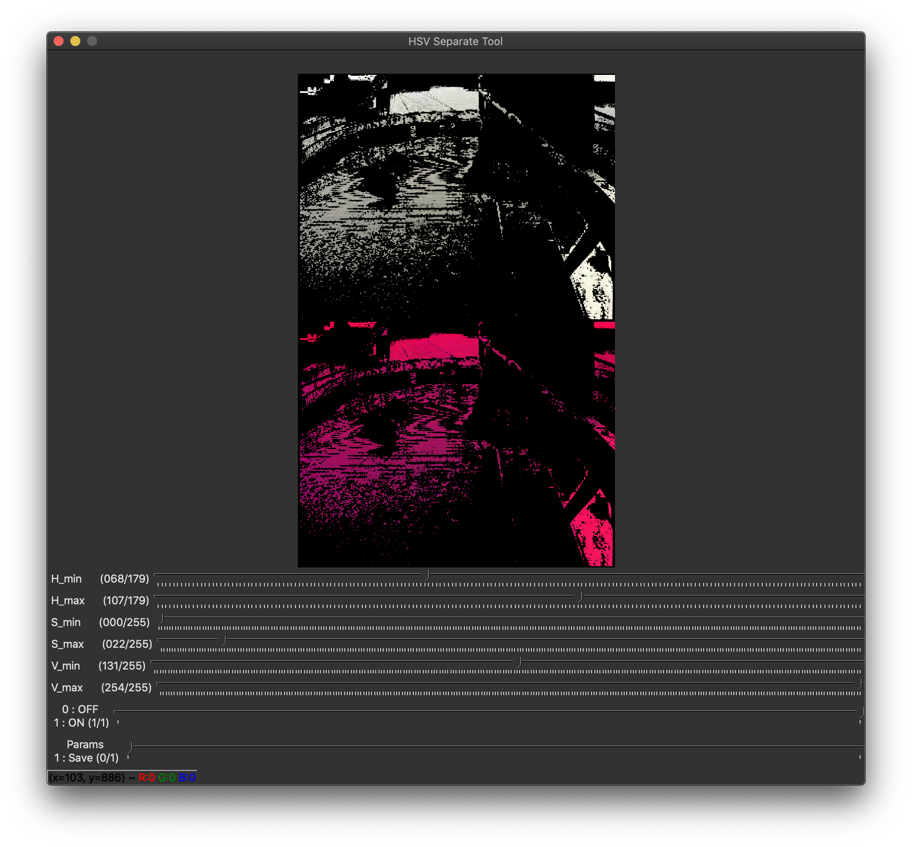
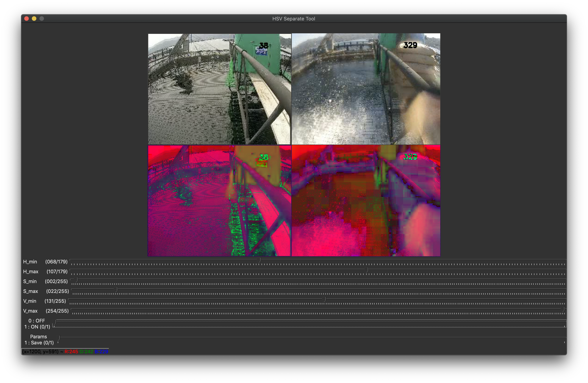

# 2020 HSV Color Separate Tool

## 環境設定
```
pip3 install -r requirements.txt
```

## 使い方

```
python3 main.py IMAGE_PATH
```

### 例

画像のパスを与えると、処理できる。

```
python3 main.py /Users/kaito/Downloads/test.jpg
```



スペースを開けてパスを複数書くことで、複数の画像を入力に指定することも可能
```
python3 main.py /Users/kaito/Downloads/test.jpg /Users/kaito/Downloads/test2.jpg
```



### ON/OFFボタン

パラメータをオンオフできる。０はOFF、１はON。

### Saveボタン

Saveボタンを１にすると現在のパラメータを保存できる。パラメータは`params.json`に保存される。
